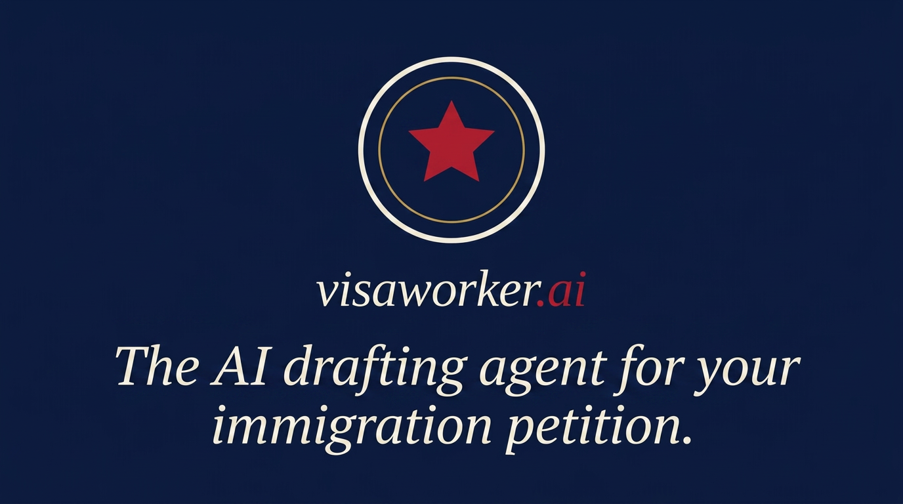

<div align="center">


# VisaWorker

**Open-core, AI-assisted drafting workspace for O-1A / EB-1A / NIW petitions.**

Bring your own Anthropic API key, upload your evidence, and produce a
lawyer-ready petition packet — recommendation letters, exhibit index, and a
compiled PDF — in one workspace.

[**Live demo**](https://visaworker.ai/demo) · [**Hosted app**](https://visaworker.ai) · [License](#license) · [Contributing](./CONTRIBUTING.md) · [Security](./SECURITY.md)

[](./LICENSE)




</div>

---

## What it is

VisaWorker is the software an immigration petition actually needs: a place to
gather evidence, draft the argument with an AI agent that knows the
adjudication standard, and assemble the final packet. This repo is the
open-source core of the product hosted at
**[visaworker.ai](https://visaworker.ai)** — you can self-host the whole thing
on your own Anthropic key.

- **Agent-drafted letters.** Chat with a Claude agent scoped to a specific
  petition (O-1A, EB-1A, or NIW). It drafts and revises recommendation letters
  and argument sections against the relevant criteria.
- **Evidence → exhibits.** Upload supporting documents; they become numbered,
  cross-referenced exhibits in the packet.
- **One-click PDF.** The whole petition compiles to a typeset PDF in the
  browser via SwiftLaTeX (WASM) — no server-side LaTeX toolchain to install.
- **Bring your own key.** Paste your Anthropic API key per project; it's
  encrypted at rest. The open build meters nothing.
- **Your data, your Postgres.** Everything lives in your own Supabase project
  behind row-level security.

> **Try it without installing anything:** the [live demo](https://visaworker.ai/demo)
> drops you into a real workspace on a seeded EB-1A petition for Elon Musk —
> chat, edit sections, and build the PDF. No sign-up.

## Quick start (self-host)

You'll need [Bun](https://bun.sh) and a free [Supabase](https://supabase.com)
project.

```bash
bun install
cp .env.example .env          # fill in your Supabase URL + publishable key
bun run dev
```

Apply the database schema (a single baseline migration) with the
[Supabase CLI](https://supabase.com/docs/guides/local-development):

```bash
supabase db push              # applies supabase/migrations/00000000000000_open_baseline.sql
```

Then open the app, create a project, and paste your Anthropic API key in
**Settings → AI Provider**. Full notes are in
[`docs/self-host.md`](./docs/self-host.md); the BYOK design is in
[`docs/byok.md`](./docs/byok.md).

## Stack

| Layer     | Choice                                                          |
| --------- | -------------------------------------------------------------- |
| Framework | TanStack Start v1 (React 19, Vite 7, SSR on Cloudflare Workers) |
| Styling   | Tailwind CSS v4                                                 |
| DB / Auth | Supabase (Postgres + Row-Level Security)                       |
| AI        | Anthropic Claude, bring-your-own-key                           |
| PDF       | SwiftLaTeX (WASM, runs in the browser)                         |
| Runtime   | Bun                                                            |

Architecture overview: [`docs/architecture.md`](./docs/architecture.md).

## Open core

This repo ships everything you need to self-host a working BYOK instance. The
commercial features that power the hosted service live behind an enterprise
carve-out (`src/ee/`) and are **not** included — in the open build their entry
points are stubs that either no-op or raise `ee_required`, so the rest of the
app keeps working:

| Feature               | Module              | Open build behavior      |
| --------------------- | ------------------- | ------------------------ |
| Stripe billing        | `src/ee/billing`    | `ee_required`            |
| Referral program      | `src/ee/referrals`  | `ee_required`            |
| Transactional email   | `src/ee/email`      | `ee_required`            |
| PostHog + Meta pixels  | `src/ee/analytics`  | no-op                    |
| Managed Anthropic key | `src/ee/ai-managed` | `ee_required` (use BYOK) |
| Lawyer intro flow     | `src/ee/lawyers`    | `ee_required`            |
| Admin dashboards      | `src/ee/admin`      | `ee_required`            |

Nothing in the core drafting loop — projects, the agent, evidence, letters, and
the PDF build — depends on these. See [`ee/LICENSE`](./ee/LICENSE) for the
proprietary terms that govern the carve-out.

## Contributing

Contributions are welcome — bug fixes, self-host improvements, and docs
especially. Please read [`CONTRIBUTING.md`](./CONTRIBUTING.md) first; it covers
the dev setup, the `src/ee/` boundary rule (open code imports only the `@/ee`
barrel, never deep paths), and the CLA.

## License

- **Core code:** [Business Source License 1.1](./LICENSE) — converts to
  Apache 2.0 four years after each release. Internal and self-hosted production
  use is permitted; running a competing hosted service is not.
- **Enterprise code** (`src/ee/`, `ee/`): proprietary — see [`ee/LICENSE`](./ee/LICENSE).
- **Trademarks:** [TRADEMARKS.md](./TRADEMARKS.md) — forks must rebrand.
- **Third-party attributions:** [NOTICE](./NOTICE).

## Security

Found a vulnerability? Please **don't** open a public issue — see
[SECURITY.md](./SECURITY.md) for private disclosure.
